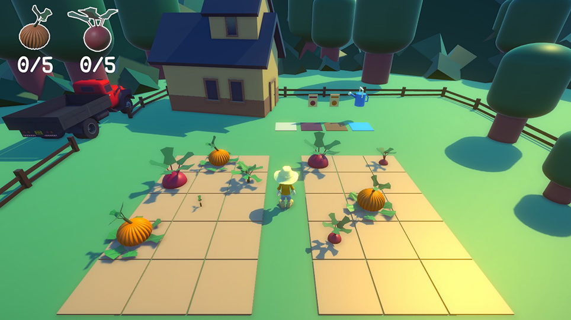

# Farmer

Projeto pessoal onde o jogador administra uma pequena fazenda, cultivando diversas plantações em seu solo para assim colher seus frutos e enviá-los para a cidade.

**Alguns recursos da Unity estudados:**
* Cinemachine com a câmera aproximando quando o jogador anda e afastando quando para.
* Sistama automático aleatório para crescimento da plantação
* Animação de movimento do jogador usando Blend Tree para fazer uma transição suave entre parado e andando

# Game
**Jogue agora em** https://geisonleite.itch.io/farmer

# Screenshots

  

    
  

